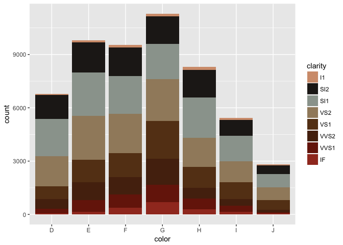
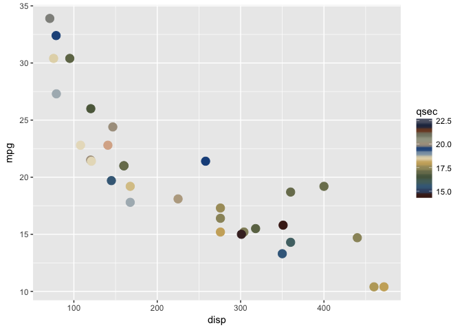
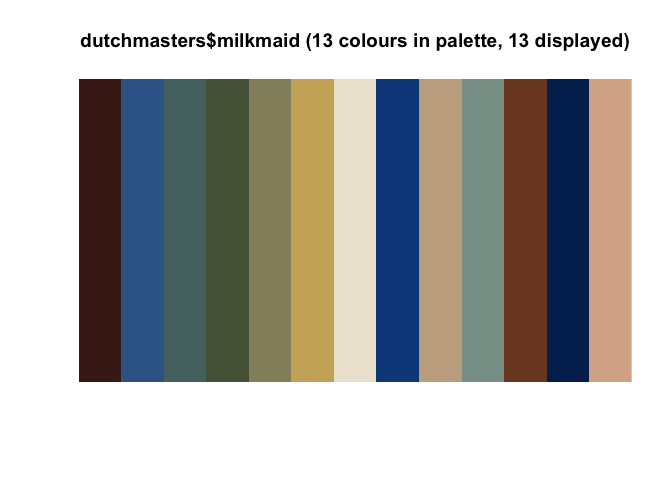
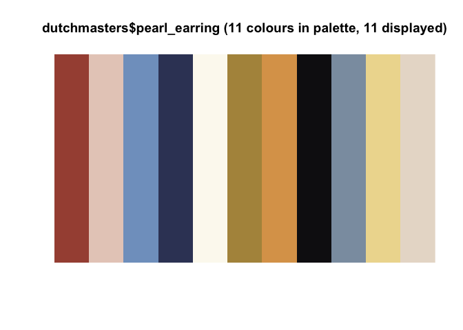
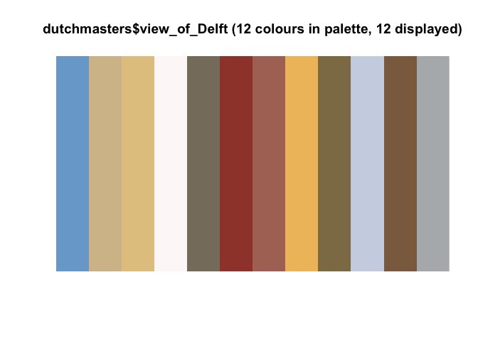
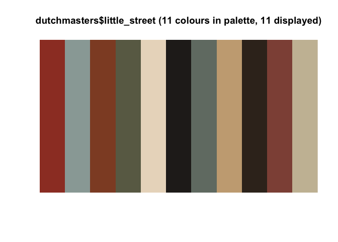
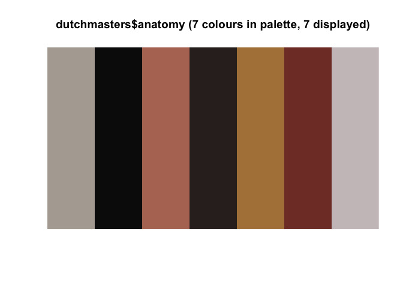
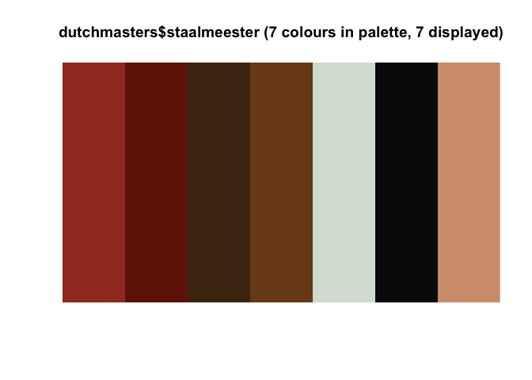

dutchmasters
============

This package offers six color palettes derived from paintings by the Dutch masters Johannes Vermeer and Rembrandt van Rijn. This package is inspired by the [`ochRe` package](https://github.com/ropenscilabs/ochRe/) and functions from this package have been shamelessly copied. The list `dutchmasters::dutchmasters` contains six named character vectors with color codes. The names represent the colors and where on the painting the color was taken.

``` r
library(dutchmasters)
dutchmasters$anatomy
```

    ## grey(corpse) black(cloak)  pink(cheek) brown(cloak) brown(table) 
    ##    "#B2AAA2"    "#0D0B0C"    "#B47562"    "#332826"    "#B18147" 
    ##  red(muscle) white(colar) 
    ##    "#803B31"    "#CBC2C3"

Examples
--------

``` r
library(ggplot2)
ggplot(diamonds, aes(color, fill = clarity)) +
  geom_bar() +
  scale_fill_dutchmasters(palette = "staalmeesters")
```



``` r
ggplot(mtcars, aes(disp, mpg, col = qsec)) +
  geom_point(size = 4) +
  scale_color_dutchmasters(discrete = FALSE)
```



The six available palettes are

Vermeer - [*The Milkmaid*](https://en.wikipedia.org/wiki/The_Milkmaid_(Vermeer))

``` r
ochRe::viz_palette(dutchmasters$milkmaid)
```



Vermeer - [*Girl with a Pearl Earring*](https://en.wikipedia.org/wiki/Girl_with_a_Pearl_Earring)

``` r
ochRe::viz_palette(dutchmasters$pearl_earring)
```



Vermeer - [*View of Delft*](https://en.wikipedia.org/wiki/View_of_Delft)

``` r
ochRe::viz_palette(dutchmasters$view_of_Delft)
```



Vermeer - [*The Little Street*](https://en.wikipedia.org/wiki/The_Little_Street)

``` r
ochRe::viz_palette(dutchmasters$little_street)
```



Rembrandt - [*The Anatomy Lesson of Dr. Nicolaes Tulp*](https://en.wikipedia.org/wiki/The_Anatomy_Lesson_of_Dr._Nicolaes_Tulp)

``` r
ochRe::viz_palette(dutchmasters$anatomy)
```



Rembrandt - [*The "Staalmeesters"*](https://en.wikipedia.org/wiki/Syndics_of_the_Drapers%27_Guild)

``` r
ochRe::viz_palette(dutchmasters$staalmeester)
```



Installation
------------

You can install `dutchmasters` from github with:

``` r
devtools::install_github("EdwinTh/dutchmasters")
```
